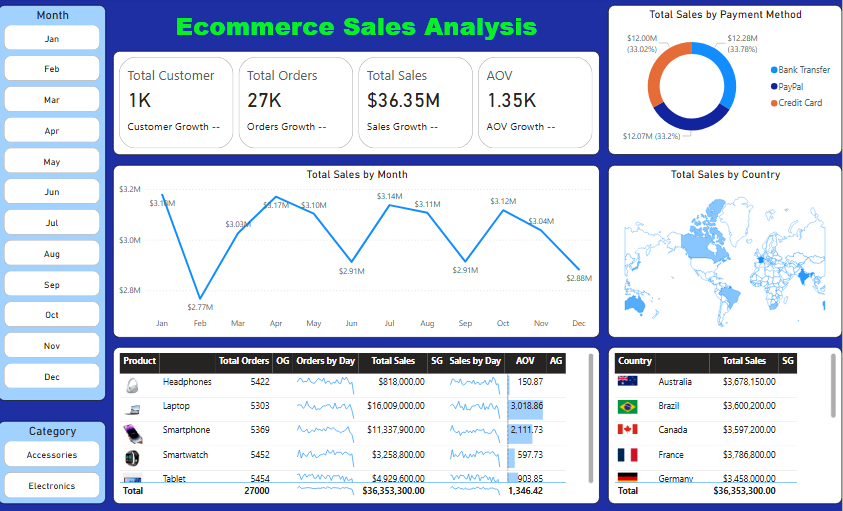

# Ecommerce-Sales-Analysis

# I. Introduction
This project explores a sales performance dashboard for an e-commerce business, with a specific focus on investigating unusually low revenue in February. The goal is to identify possible reasons behind the drop and provide actionable insights to help the business improve performance during low-demand periods. By understanding sales trends across products, countries, and payment methods, companies can make data-driven decisions to optimize their marketing and sales strategies.

## II. Analyzing insights and actionable insights

### 1. Overall Performance
- Total Annual Revenue: $36.35M
- Total Orders: 27K | Total Customers: 1K
- Total Sales Trends by Month:
  - Peak Months: April, July, October
  - Low Months: February, December

Noticed that the month has very low sales throughout the year. We need to investigate the cause and come up with a reasonable course of action.
### 2. Analyzing the sales performance of February
